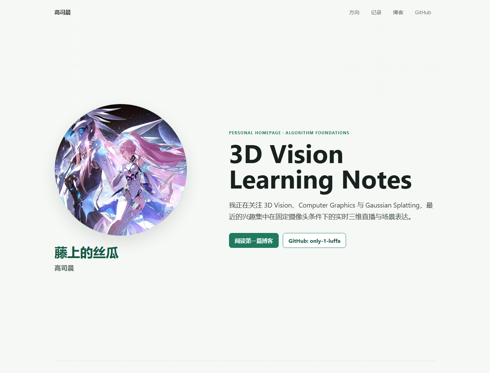
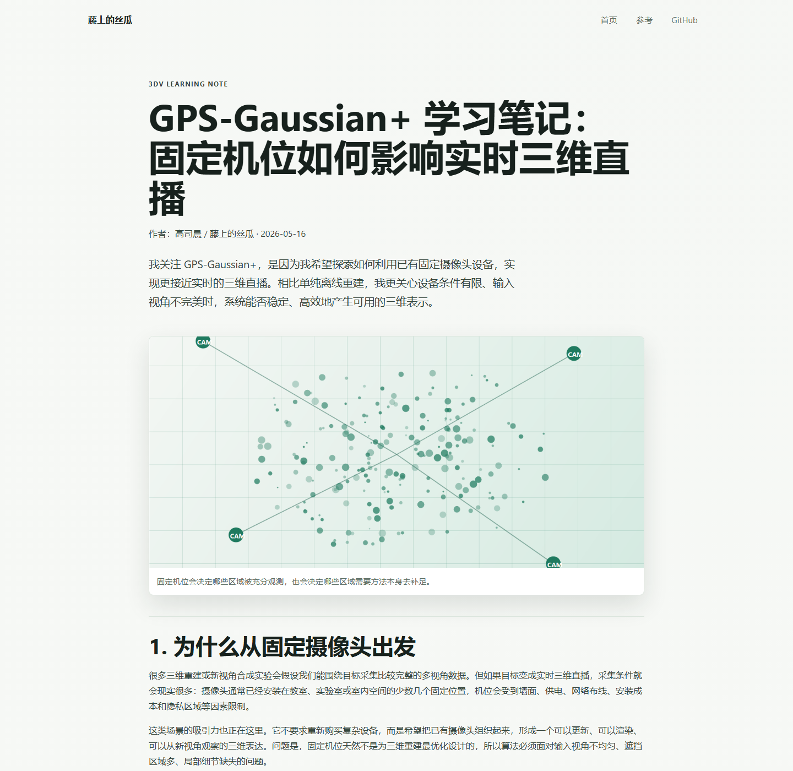

# 算法基础第一次大作业报告

## 基本信息

- 姓名：高司晨
- 昵称：藤上的丝瓜
- GitHub 用户名：only-1-luffa
- 课程：算法基础
- 作业：第一次大作业：使用 AI Agent 辅助搭建个人主页与撰写技术博客
- 提交日期：2026 年 5 月 16 日

## 1. 个人主页介绍

本次作业搭建了一个静态个人主页，主要展示个人基本信息、技术兴趣、学习记录和技术博客入口。主页公开展示的信息包括姓名“高司晨”、昵称“藤上的丝瓜”、GitHub 链接以及当前学习方向。出于隐私考虑，网页中没有公开展示学号、手机号、邮箱、照片或具体班级信息。

主页主要结构包括：

- 顶部导航：提供首页分区、博客和 GitHub 链接。
- 首页首屏：展示姓名、昵称、研究兴趣简介和主要入口。
- 学习与技术兴趣：展示 3D Vision、Gaussian Splatting、Camera Constraints 和 AI-assisted Development 等方向。
- 学习记录：记录 GPS-Gaussian+ 阅读、算法基础课程学习和 AI Agent 辅助开发过程。
- 博客入口：从主页直接跳转到本次作业完成的第一篇技术博客。

主页访问链接：部署到 GitHub Pages 后填写，例如 `https://only-1-luffa.github.io/`。本项目已准备 GitHub Pages Actions 工作流，推送到 GitHub 后可发布 `site/` 目录中的静态网页。

## 2. 博客内容介绍

博客标题为《GPS-Gaussian+ 学习笔记：固定机位如何影响实时三维直播》。文章主题属于 3D Vision / Computer Graphics 方向，围绕 GPS-Gaussian+、Gaussian Splatting、固定摄像头机位限制和实时三维直播展开。

博客主要内容包括：

- 为什么关注固定摄像头下的实时三维直播。
- Gaussian Splatting 对实时三维表达的意义。
- 固定机位带来的视角覆盖不均、遮挡和位姿误差问题。
- 从 GPS-Gaussian+ 的 sparse-view 和 real-time human-scene rendering 设定中得到的启发。
- 可能的优化方向，包括视角权重分配、摄像头布局评估、位姿校正、局部增量更新和多源信息补充。

博客访问方式：从主页的“阅读第一篇博客”或“进入博客”按钮进入。部署后链接形式为 `https://only-1-luffa.github.io/blog/gps-gaussian-plus-camera-views.html`。

## 3. 实现过程

本次网页采用纯静态技术实现，主要使用 HTML、CSS 和少量本地验证脚本。选择静态网页的原因是作业需求以个人主页、博客和部署访问为主，不需要复杂后端或前端框架。静态网站更容易部署到 GitHub Pages，也更方便检查链接和页面结构。

实现过程包括：

1. 阅读作业 PDF，整理主页、博客、报告和提交要求。
2. 与 AI Agent 讨论个人主页内容、隐私边界、博客主题和部署方式。
3. 确定网站结构，包括 `index.html`、博客页面、样式文件和项目说明文件。
4. 编写验收脚本 `tests/site_checks.py`，检查必需文件、主页到博客的跳转、博客返回首页链接、GitHub 链接和响应式样式。
5. 编写首页和博客页面，并使用统一 CSS 控制排版、卡片、按钮和响应式布局。
6. 准备部署到 GitHub Pages，推荐仓库名为 `only-1-luffa.github.io`。仓库中的 `.github/workflows/pages.yml` 会把 `site/` 目录发布为网页内容。

## 4. AI Agent 使用说明

本次作业使用 Codex 作为 AI Agent 辅助完成。AI Agent 主要参与了以下工作：

- 读取并总结作业要求。
- 协助确定个人主页的信息架构和隐私边界。
- 根据个人提供的研究兴趣，帮助整理博客主题和文章结构。
- 查询 GPS-Gaussian+、项目主页和相关公开资料，避免技术内容脱离真实背景。
- 生成静态网页代码、响应式 CSS、博客初稿和报告初稿。
- 编写本地验收脚本并运行验证。

个人参与和修改包括：

- 明确姓名、昵称、GitHub 用户名和博客方向。
- 说明关注 GPS-Gaussian+ 的原因是希望探索利用已有固定摄像头设备实现实时三维直播。
- 确认博客重点关注固定机位局限性和进一步优化方向。
- 后续将根据实际部署链接、截图和课程提交要求，对报告进行最终补充。

我对 AI 辅助编程的理解是：AI Agent 可以显著提高从需求整理到初版实现的速度，尤其适合生成网页结构、样式和报告草稿。但涉及个人理解、研究动机和技术判断的内容仍然需要自己提供方向，并对 AI 生成的技术表述进行检查。AI 更适合作为协作工具，而不是完全替代个人思考。

## 5. 结果展示

以下截图由本地浏览器打开网页后生成。最终提交前，如果 GitHub Pages 部署后的页面 URL 已经确定，可以重新打开线上页面截取同样位置的截图。

### 个人主页截图

### 博客页面截图

### 部署访问截图

部署完成后，可补充一张浏览器地址栏显示 GitHub Pages 链接的截图。

截图建议在浏览器中打开部署后的页面后截取，保证报告中展示的链接和实际提交链接一致。

## 6. 文件说明

- `site/index.html`：个人主页。
- `site/blog/gps-gaussian-plus-camera-views.html`：第一篇技术博客。
- `site/styles/main.css`：页面样式和响应式布局。
- `site/AGENTS.md`：项目规范与 AI 协作说明。
- `tests/site_checks.py`：本地验收脚本。
- `report/homework-report.md`：作业报告初稿。
